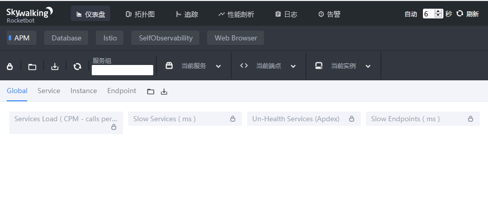
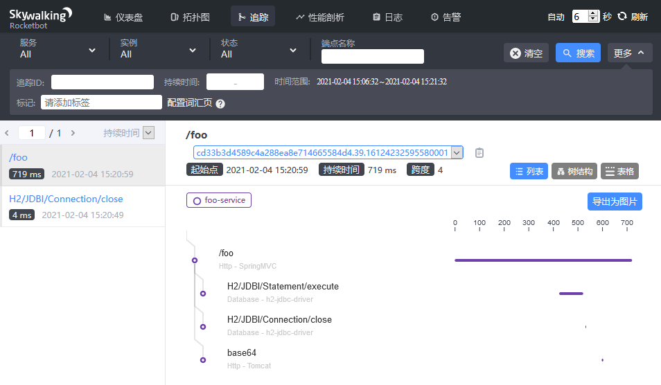

# skywalking插件开发指南

本文以开发一个记录apache-commons-codec Base64.encodeToString()方法调用情况的插件为例。

1，新建项目skywalking-plugin-example

2，配置pom，引入skywalking依赖

```xml
<dependencies>
    <dependency>
        <groupId>org.apache.skywalking</groupId>
        <artifactId>apm-agent-core</artifactId>
        <version>${skywalking.versoin}</version>
        <scope>provided</scope>
    </dependency>
    <dependency>
        <groupId>net.bytebuddy</groupId>
        <artifactId>byte-buddy</artifactId>
        <version>${bytebuddy.version}</version>
        <scope>provided</scope>
    </dependency>
    <dependency>
        <groupId>org.apache.skywalking</groupId>
        <artifactId>apm-util</artifactId>
        <version>${skywalking.versoin}</version>
        <scope>provided</scope>
    </dependency>
</dependencies>
```


3，新建类Base64Instrumentation，继承类ClassEnhancePluginDefine/ClassInstanceMethodsEnhancePluginDefine/ClassStaticMethodsEnhancePluginDefine。

本例选择ClassInstanceMethodsEnhancePluginDefine

这个类的用处类似于AOP中的Advisor，包括pointcut+advice。即告诉skywalking，拦截哪些方法和拦截到方法之后执行的操作。

4，新建类Base64EncodeInterceptor，实现接口InstanceMethodsAroundInterceptor/InstanceConstructorInterceptor/StaticMethodsAroundInterceptor

本例选择InstanceMethodsAroundInterceptor

这个类实现AOP中advice的作用，在拦截到指定方法后回调。可以在方法中执行创建span、记录信息等操作。

5，打包编译。由于插件开发依赖bytebuddy，所以需要把bytebuddy加入环境。官方会把bytebuddy放入自己的jar包中国，并用maven-shade-plugin插件，把插件代码中import的bytebuddy路径替换为skywalking包路径。当然也可以使用其他方式把bytebuddy的class repackage到插件jar中。

6，下载skywalking，建议在测试中使用h2版skywalking，默认数据源为h2，可以直接启动

7，将打包好的插件jar放入skywalking目录：{skywalking_home}\agent\plugins\

如：

> D:\opt\apache-skywalking-apm-bin-es7\agent\plugins

执行{skywalking_home}\bin\startup.bat，启动skywalking

打开http://localhost:8080查看skywalking ui界面



8，新建项目foo-service，作为测试服务

启动服务加入启动参数-javaagent:{skywalking_home}\agent\skywalking-agent.jar

如：

> java -jar -javaagent:D:\workspace\skywalking-plugin-example\apache-skywalking-apm-bin-es7\agent\skywalking-agent.jar -DSW_AGENT_NAME=foo-service foo-service-1.0-SNAPSHOT.jar

9，调用服务接口

> curl http://localhost:8081/foo?p=a

10， 刷新skywalking ui，查看trace记录

